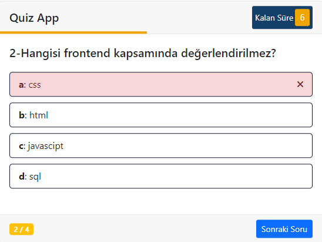

# #Quiz Box
## Uygulama Tanımı
Web tabanlı sorular çözüp kullanıcıların kendilerini sınayabileceği 4 şık cevap seçeneği ve 10 saniye soru çözme süresi
bulunan Javascript tabanlı bir web uygulaması.
> Bu projede **Object Oriented Programming (OOP)** tekniği kullanılmıştır.
> OOP tekniğini geliştirmek amacı ile proje oluşturulmuştur.
## Projeden Görüntüler

## Kullanılan Teknolojiler
- HTML
- CSS
- [Javascript](https://www.javascript.com)
- [Bootstrap](https://getbootstrap.com)
## Yardımcı Kaynaklar
- Sadık Turhan - [Komple Uygulamalı Web Geliştirme](https://www.udemy.com/course/komple-web-developer-kursu/) Bölüm 16: Javascript Bölüm 13: OOP
## License
- #### MIT
## Oluşturan
### `Burak Kurt`
| Social | Link |
| ------ | ------ |
| Github | https://github.com/burakkrt |
| Linkedin | https://www.linkedin.com/in/kurt-burak/ |
| Mail | krtburak@outlook.com |